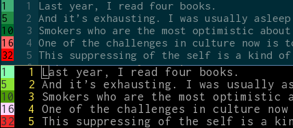

vim-readability
=================

A Vim plug-in that calculates the [Flesch-Kincaid readability grade](https://en.wikipedia.org/wiki/Flesch%E2%80%93Kincaid_readability_tests) for every line in your document and displays the result in the sign column.

## Dependencies

### Ruby
Plug-in requires the [odyssey](<https://github.com/cameronsutter/odyssey>) ruby library for calculating the index.

### Vim +ruby Feature Support
Vim requires that it is compiled with support for `+ruby` you can see if your vim supports it by running :version; 
On Ubuntu it may require that you install `vim-gtk` and start it with `vim.gtk`

## Installation

* With [pathogen.vim](https://github.com/tpope/vim-pathogen):

        cd ~/.vim/bundle
        git clone git://github.com/pondrejk/vim-readability.git

* With [Vundle](https://github.com/gmarik/vundle):

        " .vimrc
        Bundle 'pondrejk/vim-readability'

## Usage

To initialize the sign column:

> :ReadGradeOn

To turn it off:

> :ReadGradeOff

There is also the `:ReadGradeToggle` command you can map to a selected key in your .vimrc, for example:

```Vim
nmap <silent> <F11> :ReadGradeToggle<CR>
imap <silent> <F11> <ESC>:ReadGradeToggle<CR>
cmap <silent> <F11> <ESC>:ReadGradeToggle<CR>
```

To automatically update the column on buffer save (disabled by default), put this into your .vimrc:

```Vim
let g:readability_onsave = 0
```

To customize colors used in GUI, set the following variables in your .vimrc (default values displayed here):

```Vim
let g:read_guifg="#000000"
let g:read_guibg_dumb="#41ae76"
let g:read_guibg_easy="#238b45"
let g:read_guibg_medium="#006d2c"
let g:read_guibg_hard="#ff6666"
let g:read_guibg_bloat="#ff0000"
```

Similarly for the console colors:

```Vim
let g:read_ctermfg="Black"
let g:read_ctermbg_dumb="LightGreen"
let g:read_ctermbg_easy="Green"
let g:read_ctermbg_medium="DarkGreen"
let g:read_ctermbg_hard="LightMagenta"
let g:read_ctermbg_bloat="Red"
```

Readability column in action in GUI and CLI (sentences are from an [excellent essay](https://medium.com/@hughmcguire/why-can-t-we-read-anymore-503c38c131fe#.svxaye4p4) by Hugh McGuire):



To blacklist selected words from calculation, enable the following variable in your .vimrc:

```Vim
let g:readability_blacklist_on = 1
```

By default, plug-in searches for the blacklist at .vim/bundle/vim-readability/blacklist.txt", you can change the path by setting the following variable in your .vimrc (default shown):

```Vim
let g:readability_blacklist_path = ".vim/bundle/vim-readability/blacklist.txt"
```

## Notes & known issues

* readability metrics provided by odyssey are designed for English only
* right now, there is just one sign column in Vim, so if you use git-gutter or similar plug-in, vim-readability will overwrite signs made by these plug-ins, sorry

## TODO

* implement and other readability metrics provided by odyssey
* be friends with markdown and asciidoc (odyssey does xml parsing by default)
